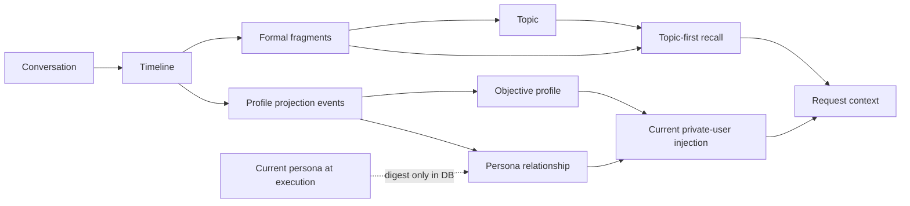

<a href="README.md">中文</a> &nbsp;/&nbsp; <strong>English</strong> &nbsp;/&nbsp; <a href="README_ru.md">Русский</a>

<h1>LivingMemory</h1>

<strong>Source-grounded long-term memory for AstrBot: preserve experience, reorganize themes, and recall with context.</strong>

CAPTURE &nbsp;&nbsp; ORGANIZE &nbsp;&nbsp; RECALL &nbsp;&nbsp; MAINTAIN

  
  
  
  

## Memory in layers

<table>
<tr>
<td width="33%"><strong>TIMELINE PRESERVES</strong>  Continuous conversations become editable memories with facts, affect, time ranges, actor bindings, and source snapshots.</td>
<td width="33%"><strong>TOPIC ORGANIZES</strong>  Formal fragments connect related experiences across time without losing their Timeline revision or provenance.</td>
<td width="33%"><strong>PROFILES UNDERSTAND</strong>  The same Timeline independently maintains objective facts about the current private user and each persona's subjective relationship.</td>
</tr>
</table>

## One maintainable memory system

| Build | Recall | Operate |
| :--- | :--- | :--- |
| **One source, two derived routes** Timeline is editable; Topic and governed user profiles derive from it in parallel. | **Current-query control** The current message qualifies candidates; recent context only adds bounded support. | **Atomic publication** Failed Topic builds or profile jobs leave the active generation intact. |
| **Traceable structure** Facts, actors, emotion, formal fragments, and revisions retain source links. | **Optional Rerank** A configured provider or built-in Cloudflare client can refine qualified candidates. | **Unified maintenance** Review, rebuild, session audit, database health, recall traces, and model tests share one workspace. |
| **Bounded incremental updates** New Timeline revisions match a limited neighborhood of existing Topics. | **Two Topic search modes** Search titles, summaries, and facts by keyword, or use Embedding similarity to find related themes. | **Data lifecycle** Backups, staged edits, import/export, cleanup, archive, and in-place reconstruction are explicit operations. |
| **Topic continuation** After the base round count, pending themes may extend the summary boundary until the configured hard limit. | **Agent-native tools** `recall_long_term_memory` and `memorize_long_term_memory` support active memory use. | **Duplicate-submit guards** Long-running actions lock immediately and restore persisted task state after refresh. |
| **Private user profiles** Traceable Timeline facts form a concise profile, while each persona keeps its own subjective relationship continuity. | **Current-user only** Profiles inject only for a stable private peer; active recall must request them explicitly and cannot query arbitrary users. | **Profile governance** Conflicts, freshness, sensitive data, account binding, relationship revisions, and historical rebuild remain explicit operations. |

## Start in three moves

1. Install LivingMemory from the AstrBot Plugin Market. You can also use the WebUI `+` button to install from this repository URL or a downloaded ZIP archive.
2. Reload AstrBot and open the plugin configuration. Select an LLM and Embedding provider, or leave their IDs empty to use AstrBot defaults.
3. Verify Timeline creation, test the configured models, then enable Topic memory and run the first full build.

| Provider | Purpose |
| :--- | :--- |
| LLM | Timeline summarization, formal-fragment extraction, and Topic construction. |
| Embedding | Timeline, formal-fragment, and Topic vectors. |
| Rerank | Optional candidate refinement; the plugin also supports a built-in Cloudflare Workers AI client. |

Open the workspace at `Plugins -> LivingMemory -> Pages -> dashboard`. The WebUI adapts to desktop and mobile layouts; on mobile, use the top-left navigation button to switch pages. Plugin Pages requires **AstrBot 4.24.2 or later**.

## Go deeper

| Learn | Configure | Recall | Maintain |
| :--- | :--- | :--- | :--- |
| [Quick start](https://eco404.github.io/astrbot_plugin_livingmemory/en/guide/getting-started) | [Configuration](https://eco404.github.io/astrbot_plugin_livingmemory/en/configuration) | [Recall pipeline](https://eco404.github.io/astrbot_plugin_livingmemory/en/recall) | [Maintenance center](https://eco404.github.io/astrbot_plugin_livingmemory/en/maintenance) |

The complete architecture, Timeline, Topic, and user-profile contracts, commands, migration behavior, and data-safety boundaries are documented on the [VitePress site](https://eco404.github.io/astrbot_plugin_livingmemory/en/).

Database upgrades follow the public `v8 -> v9 -> v10 -> v10.4` path. User-profile structures enter the release line as one `v10.3 -> v10.4` migration. Back up plugin data before testing development builds or destructive maintenance operations.

## Project

[Documentation](https://eco404.github.io/astrbot_plugin_livingmemory/en/) · [Releases](https://github.com/Eco404/astrbot_plugin_livingmemory/releases) · [Changelog](CHANGELOG.md) · [Development log](docs/DEVELOPMENT_LOG.md) · [Issues](https://github.com/Eco404/astrbot_plugin_livingmemory/issues)

LivingMemory is released under the [AGPL-3.0 license](LICENSE).

## Origin and attribution

This repository is maintained by **econeco** as an independently developed branch. It is based on the original [astrbot_plugin_livingmemory](https://github.com/lxfight-s-Astrbot-Plugins/astrbot_plugin_livingmemory) project by **lxfight**. The original project and author are credited for the foundation on which this branch was built.
