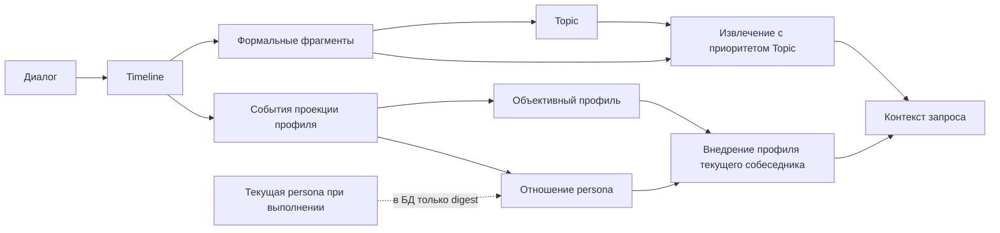

<a href="README.md">中文</a> &nbsp;/&nbsp; <a href="README_en.md">English</a> &nbsp;/&nbsp; <strong>Русский</strong>

<h1>LivingMemory</h1>

<strong>Долговременная память AstrBot с проверяемыми источниками: сохраняет опыт, упорядочивает темы и возвращает нужный контекст.</strong>

СОХРАНЕНИЕ &nbsp;&nbsp; ОРГАНИЗАЦИЯ &nbsp;&nbsp; ИЗВЛЕЧЕНИЕ &nbsp;&nbsp; ОБСЛУЖИВАНИЕ

  
  
  
  

## Память по уровням

<table>
<tr>
<td width="33%"><strong>TIMELINE СОХРАНЯЕТ</strong>  Непрерывные диалоги становятся редактируемой памятью с фактами, эмоциями, временными диапазонами, привязками участников и снимками источников.</td>
<td width="33%"><strong>TOPIC ОРГАНИЗУЕТ</strong>  Формальные фрагменты связывают относящийся к одной теме опыт разных периодов, сохраняя Timeline revision и происхождение данных.</td>
<td width="33%"><strong>ПРОФИЛИ ПОМОГАЮТ ПОНИМАТЬ</strong>  Из той же Timeline независимо поддерживаются объективные факты о текущем собеседнике и субъективное отношение каждой persona.</td>
</tr>
</table>

## Единая обслуживаемая система памяти

| Сборка | Извлечение | Обслуживание |
| :--- | :--- | :--- |
| **Один источник, два производных пути** Timeline редактируется; Topic и управляемые профили пользователей независимо производятся из неё. | **Приоритет текущего запроса** Текущее сообщение определяет допустимых кандидатов; недавний контекст даёт лишь ограниченную поддержку. | **Атомарная публикация** Сбой сборки Topic или задачи профиля не повреждает активную версию данных. |
| **Полная трассировка** Факты, участники, эмоции, формальные фрагменты и ревизии сохраняют связи с источниками. | **Опциональный Rerank** Настроенный Provider или встроенный клиент Cloudflare уточняет порядок уже подходящих кандидатов. | **Единый центр обслуживания** Проверка, реконструкция, аудит сессий, состояние базы, история извлечения и тесты моделей доступны в одном интерфейсе. |
| **Ограниченные инкрементальные обновления** Новые ревизии Timeline сопоставляются с ограниченным числом ближайших Topic. | **Два режима поиска Topic** Поиск по заголовкам, сводкам и фактам либо по семантической близости Embedding. | **Жизненный цикл данных** Резервные копии, отложенные правки, импорт, экспорт, очистка, архивирование и реконструкция выполняются явно. |
| **Продолжение темы** После базового числа реплик незавершённая тема может продлить окно суммаризации до настроенного жёсткого предела. | **Инструменты агента** `recall_long_term_memory` и `memorize_long_term_memory` позволяют агенту явно работать с памятью. | **Защита от повторного запуска** Длительные операции сразу блокируют повторную отправку и восстанавливают состояние задачи после обновления страницы. |
| **Профили приватных пользователей** Проверяемые факты Timeline образуют компактный профиль, а каждая persona сохраняет собственную непрерывность субъективного отношения. | **Только текущий пользователь** Профиль внедряется только для стабильного собеседника в приватном чате; активное извлечение должно запросить его явно и не может читать произвольных пользователей. | **Управление профилем** Конфликты, актуальность, чувствительные данные, привязка аккаунтов, ревизии отношений и историческая реконструкция управляются отдельно. |

## Быстрый старт

1. Установите LivingMemory из AstrBot Plugin Market. Также можно нажать `+` на странице плагинов и установить его по URL репозитория или из ZIP-архива.
2. Перезагрузите AstrBot и откройте настройки плагина. Выберите LLM и Embedding Provider либо оставьте их ID пустыми, чтобы использовать модели AstrBot по умолчанию.
3. Проверьте создание Timeline и работу моделей, затем включите Topic и запустите первую полную сборку.

| Provider | Назначение |
| :--- | :--- |
| LLM | Суммаризация Timeline, выделение формальных фрагментов и построение Topic. |
| Embedding | Векторы Timeline, формальных фрагментов и Topic. |
| Rerank | Опциональное уточнение порядка кандидатов; также поддерживается встроенный клиент Cloudflare Workers AI. |

Рабочее пространство открывается через `Plugins -> LivingMemory -> Pages -> dashboard`. WebUI адаптирован для настольных и мобильных экранов; на телефоне страницы переключаются кнопкой навигации в левом верхнем углу. Для Plugin Pages требуется **AstrBot 4.24.2 или новее**.

## Подробнее

| Начало работы | Настройка | Извлечение | Обслуживание |
| :--- | :--- | :--- | :--- |
| [Быстрый старт](https://eco404.github.io/astrbot_plugin_livingmemory/en/guide/getting-started) | [Параметры](https://eco404.github.io/astrbot_plugin_livingmemory/en/configuration) | [Конвейер извлечения](https://eco404.github.io/astrbot_plugin_livingmemory/en/recall) | [Центр обслуживания](https://eco404.github.io/astrbot_plugin_livingmemory/en/maintenance) |

Полная архитектура, контракты Timeline, Topic и профилей пользователей, команды, миграции и границы безопасности данных описаны в документации на [английском](https://eco404.github.io/astrbot_plugin_livingmemory/en/) и [китайском](https://eco404.github.io/astrbot_plugin_livingmemory/).

Публичный путь обновления базы данных: `v8 -> v9 -> v10 -> v10.4`. Структуры профилей пользователей входят в релизную ветку одной миграцией `v10.3 -> v10.4`. Перед тестированием разрабатываемых версий или опасными операциями обслуживания создайте резервную копию данных плагина.

## Проект

[Документация](https://eco404.github.io/astrbot_plugin_livingmemory/en/) · [Релизы](https://github.com/Eco404/astrbot_plugin_livingmemory/releases) · [История изменений](CHANGELOG.md) · [Журнал разработки](docs/DEVELOPMENT_LOG.md) · [Проблемы](https://github.com/Eco404/astrbot_plugin_livingmemory/issues)

LivingMemory распространяется по лицензии [AGPL-3.0](LICENSE).

## Исходный проект и авторство

Этот репозиторий поддерживается **econeco** как независимо развиваемая ветка. Он основан на исходном проекте [astrbot_plugin_livingmemory](https://github.com/lxfight-s-Astrbot-Plugins/astrbot_plugin_livingmemory), созданном **lxfight**. Мы сохраняем указание исходного проекта и автора, заложивших основу этой ветки.
