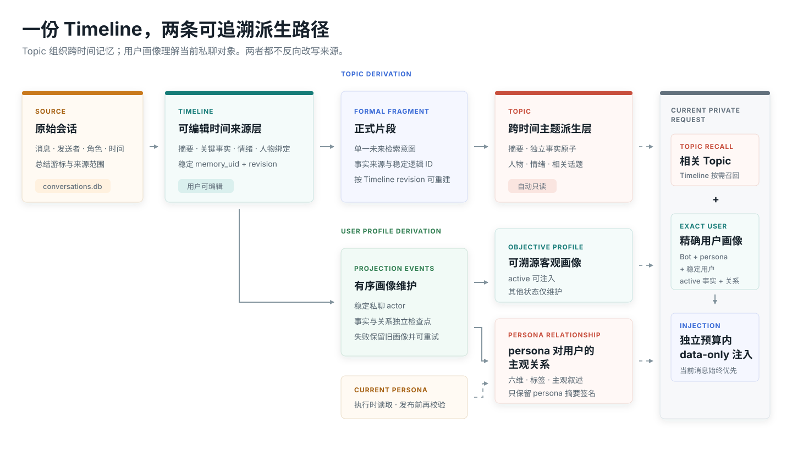
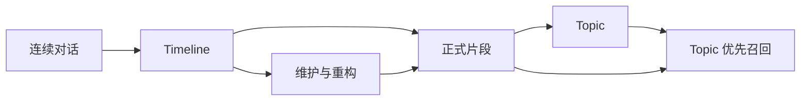

<strong>中文</strong> &nbsp;/&nbsp; <a href="README.md">English</a> &nbsp;/&nbsp; <a href="README_ru.md">Русский</a>

<h1>LivingMemory</h1>

<strong>为 AstrBot 构建可溯源的长期记忆：保存经历、整理主题，并带着语境准确召回。</strong>

沉淀 &nbsp;&nbsp; 整理 &nbsp;&nbsp; 召回 &nbsp;&nbsp; 维护

  
  
  
  

## 让记忆形成层次

<table>
<tr>
<td width="33%"><strong>TIMELINE 保存经历</strong>  连续对话沉淀为可编辑记忆，保留事实、情绪、时间范围、人物绑定与来源快照。</td>
<td width="33%"><strong>TOPIC 整理主题</strong>  正式片段跨时间归并相关经历，同时保留 Timeline revision 与完整溯源。</td>
<td width="33%"><strong>召回保持聚焦</strong>  以 Topic 为主体，只补充真正增加信息的事实和片段，必要时回退到 Timeline。</td>
</tr>
</table>

## 一套可长期维护的记忆系统

| 构建 | 召回 | 运维 |
| :--- | :--- | :--- |
| **双层记忆架构** Timeline 是可修正来源，Topic 是只读派生层。 | **当前消息主导** 当前查询决定候选资格，最近上下文只提供有界辅助。 | **原子发布** Topic 构建失败或取消时，现有正式数据保持可用。 |
| **完整溯源结构** 事实、人物、情绪、正式片段和 revision 保留来源关系。 | **可选 Rerank** 可使用 AstrBot Provider 或插件内置 Cloudflare 客户端精排。 | **统一维护中心** 重构、审查、会话审计、数据库检查、真实召回与模型测试集中管理。 |
| **有界增量维护** 新增 Timeline 只与有限数量的既有 Topic 近邻匹配。 | **双模式 Topic 搜索** 可按标题、摘要和事实关键字搜索，也可使用 Embedding 查找语义相关主题。 | **明确的数据生命周期** 备份、暂存编辑、导入导出、清理、归档与同 ID 重构都有独立操作。 |
| **话题接续** 基础轮次后按未总结话题判断是否延后边界，并由强制上限保证最终落库。 | **Agent 原生工具** `recall_long_term_memory` 与 `memorize_long_term_memory` 支持主动使用记忆。 | **防重复操作** 长任务提交后锁定对应操作，刷新页面仍可恢复任务状态。 |

## 三步开始

1. 从 AstrBot 插件市场安装 LivingMemory；也可以在插件页点击右下角 `+`，通过本仓库 URL 或下载的 ZIP 安装。
2. 重载 AstrBot 并打开插件配置，选择 LLM 与 Embedding Provider；对应 ID 留空时使用 AstrBot 默认模型。
3. 确认 Timeline 能正常生成，在维护中心测试模型，然后启用 Topic 并执行第一次全量构建。

| Provider | 用途 |
| :--- | :--- |
| LLM | Timeline 总结、正式片段提取与 Topic 构建。 |
| Embedding | Timeline、正式片段和 Topic 的向量。 |
| Rerank | 可选候选精排；插件也提供内置 Cloudflare Workers AI 客户端。 |

可视化工作区入口为 `插件 -> LivingMemory -> Pages -> dashboard`。WebUI 适配桌面与手机端，手机端通过左上角导航按钮切换页面。插件 Pages 需要 **AstrBot 4.24.2 或更高版本**。

## 深入了解

| 入门 | 配置 | 召回 | 维护 |
| :--- | :--- | :--- | :--- |
| [快速开始](https://eco404.github.io/astrbot_plugin_livingmemory/guide/getting-started) | [配置参考](https://eco404.github.io/astrbot_plugin_livingmemory/configuration) | [召回管线](https://eco404.github.io/astrbot_plugin_livingmemory/recall) | [维护中心](https://eco404.github.io/astrbot_plugin_livingmemory/maintenance) |

完整架构、Timeline 与 Topic 数据契约、命令、迁移行为和数据安全边界请查看 [VitePress 文档站](https://eco404.github.io/astrbot_plugin_livingmemory/)。

数据库升级遵循公开的 `v8 -> v9 -> v10` 路径，再进入当前 `v10.x` 小版本。测试开发版本或执行危险维护操作前，请先备份插件数据。

## 项目

[完整文档](https://eco404.github.io/astrbot_plugin_livingmemory/) · [版本发布](https://github.com/Eco404/astrbot_plugin_livingmemory/releases) · [更新记录](CHANGELOG.md) · [详细开发日志](docs/DEVELOPMENT_LOG.md) · [问题反馈](https://github.com/Eco404/astrbot_plugin_livingmemory/issues)

LivingMemory 使用 [AGPL-3.0 许可证](LICENSE)发布。

## 原项目与作者

当前仓库由 **econeco** 作为独立开发分支持续维护，基于 **lxfight** 创建的原项目 [astrbot_plugin_livingmemory](https://github.com/lxfight-s-Astrbot-Plugins/astrbot_plugin_livingmemory) 发展而来。感谢原项目及原作者提供的基础实现。
