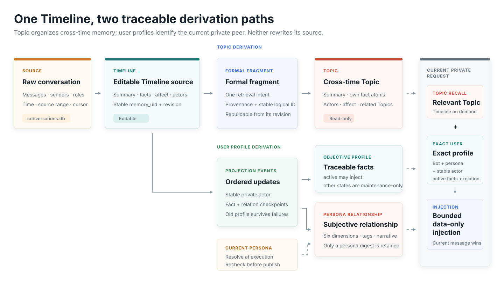

# Architecture

LivingMemory uses Timeline as its editable source layer and Topic as its derived retrieval layer. They do not share fact atoms; stable IDs, revisions, formal fragments, and provenance links connect them.

{.diagram}

## Data layers

| Layer | Contents | Directly editable | Purpose |
| --- | --- | --- | --- |
| Raw conversation | Messages, senders, roles, timestamps | No | Evidence, rebuilding, session audit |
| Timeline | Summary, facts, topics, affect, actor bindings | Yes | Chronological experience |
| Formal fragment | One retrieval intent plus fact-level provenance | No | Topic construction and concise supplements |
| Topic | Derived summary, atoms, actors, relations, affect | No | Cross-time organization and primary recall |

## Identity and provenance

Timeline has a stable `memory_uid` and revision. Formal fragments have stable logical IDs and revisions. Topic publication replaces the complete derived snapshot atomically. A Topic fact traces through its fragment to a specific Timeline revision and source fact or source window.

## Actors and affect

Message senders and Timeline role bindings anchor identity. The model may only select actor references supplied by code; unresolved mentions remain local rather than being merged by nickname. Affect events keep intensity, target, and source so retrieval does not reduce every interaction to neutral facts.

## The graph route

The graph remains an optional Timeline-derived retrieval route. It is not the authoritative source for Topic construction or Topic-first recall; provenance follows Timeline, formal fragments, Topic, and their link tables.
