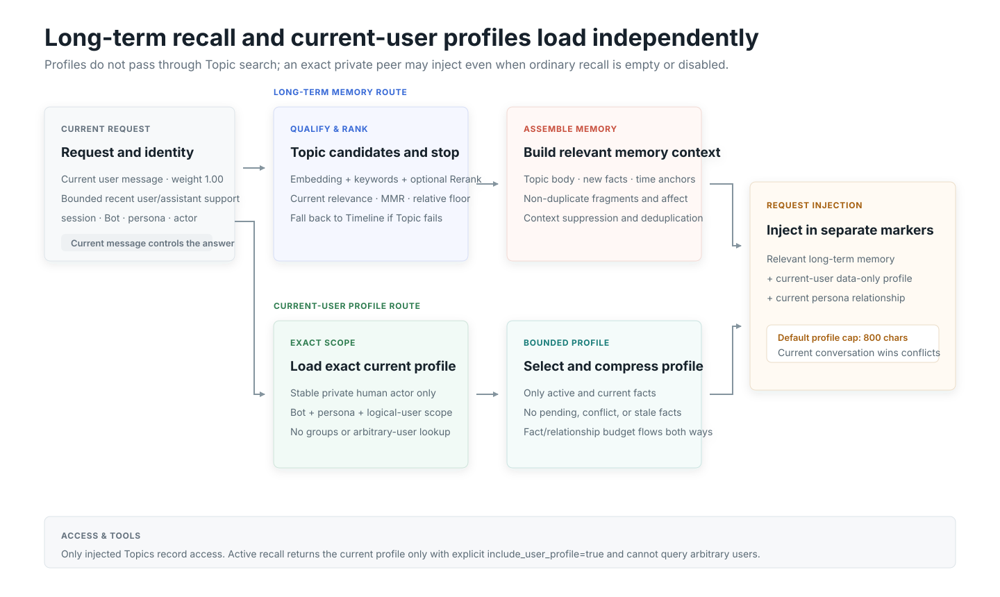

<section class="home-band">
  Memory architecture
  <h2>Two memory layers, one traceable chain</h2>
  
Timeline records what happened. Topic reorganizes related events for retrieval. Formal fragments, facts, actors, and stable revisions keep both layers connected.

{.diagram}

  

    
<h3>Timeline is the source layer</h3>
Round, idle, or manual summarization produces editable memories with source ranges and stable identity.

    
<h3>Topic is the derived layer</h3>
Topics are read-only. Changes flow from Timeline through formal fragments into atomically published Topic snapshots.

  

</section>

<section class="home-band">
  Recall
  <h2>Relevance first, context preserved</h2>
  
The current message controls eligibility. Recent context adds bounded support; formal fragments and facts restore concrete events and affect.

{.diagram}
</section>

<section class="home-band">
  Operations
  <h2>Long-running memory needs maintenance</h2>
  
The maintenance center separates routine browsing from rebuilds, reviews, cleanup, database work, and diagnostics.

  

    
<h3>Build and repair</h3>
Atomic full builds, bounded incremental updates, and in-place Timeline reconstruction.

    
<h3>Audit and diagnose</h3>
Review ambiguity, inspect real recall traces, test models, and audit sessions.

    
<h3>Clean and archive</h3>
Remove completed build artifacts, manage inactive memories, and compact storage on demand.

    
<h3>Migrate and recover</h3>
Backed-up migrations follow v8 to v9 to v10, then the current v10.x schema.

  

</section>
