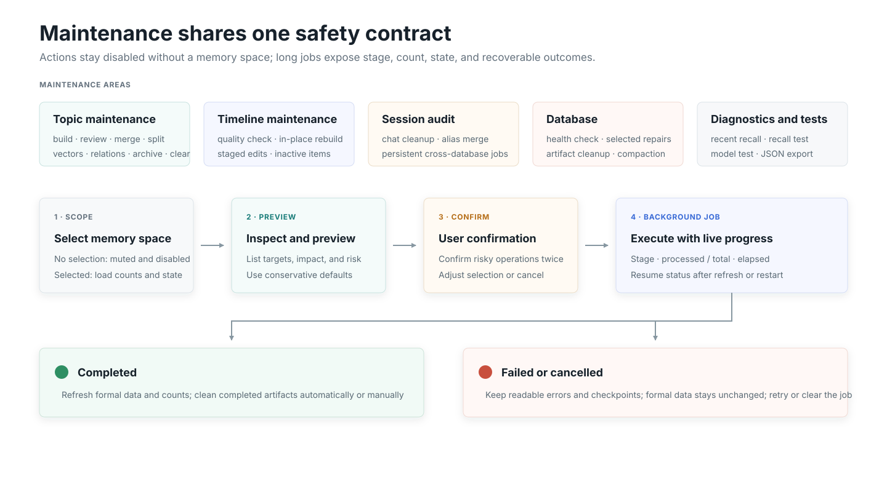

# Maintenance center

The maintenance center uses one interaction contract: inspect, preview, confirm, execute, show progress, and preserve rollback boundaries.

{.diagram}

## Topic maintenance

It provides revectorization, related-Topic recalculation, incremental completion, ambiguity review, split and merge, archived Topic management, and complete derived-data cleanup for a selected memory space. Split/merge previews preserve the selected primary Topic and fragment groups across redraws.

## Timeline maintenance

Users can detect reconstructable or low-quality Timeline entries, apply staged edits in a batch, and manage inactive Timeline. Reconstruction preserves the Timeline ID; all selected Timeline items finish before Topic synchronization begins.

## User profile maintenance

The user-profile tab groups scopes by stable private account, Bot account, and persona. Its effective-injection preview uses the same relevance, freshness, and character-budget rules as the private-chat path.

| Area | Operations |
| --- | --- |
| Objective facts | Inspect raw Timeline facts and revisions; confirm pending facts, pause/resume injection, pin, or exclude |
| Conflicts | Select a winner, keep injection paused, or exclude all; later evidence may still trigger automatic review |
| Relationship | Edit six dimensions, tags, narrative, sensitivity, and behavior; freeze, reset, rebuild, or roll back a revision |
| Accounts | Manually bind accounts after a preview; unbinding reprojects from original-account provenance |
| Sharing | Explicitly share objective facts across selected scopes for one logical user; relationships stay isolated |
| Recovery | Inspect and retry jobs, handle detected gaps, or rebuild from history |

Raw objective-fact text cannot be edited on this page. Correct the authoritative Timeline or use confirmation, pause, exclusion, and conflict overrides. Relationship dimensions and subjective narrative are directly editable, with prior values retained in revision history.

**Reset profile** clears derived output but keeps the scope enabled and processes new changes from that point. **Delete and disable** also removes relationship state and blocks automatic re-enrollment. Historical rebuild is separate: it previews the Timeline, fact, and override impact and rejects stale preview fingerprints.

## Session and database maintenance

Session audit distinguishes message cleanup, removal of raw conversations, alias merging, and complete memory-chain deletion. Cross-database work is persisted as recoverable maintenance tasks.

Database health checks are read-only until users select repairs. Completed build artifacts can be cleaned automatically during daily maintenance; `VACUUM` remains an explicit operation because it temporarily locks SQLite.

## Traces and tests

Production recall tracing is off by default. When enabled, records show original triggers, selected memories, exact injection, and diagnostics. Recall and model tests retain independent history and JSON export.

## Atomic publication

Long Topic jobs stage all derived output and switch the formal snapshot only after validation. Existing Topics remain available during construction, and failed or cancelled jobs never expose partial atoms or actor links.

Confirmation controls lock immediately after submission to prevent duplicate operations. Persisted tasks restore their progress after a page refresh.
