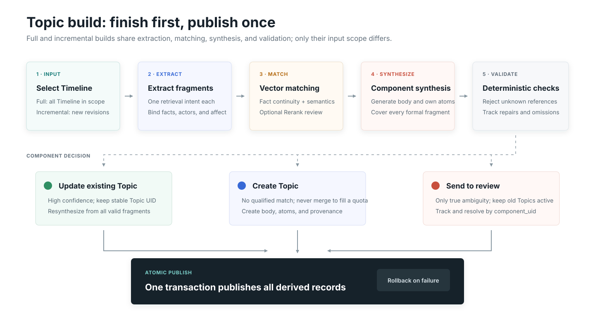

# Topic memory

Topic reorganizes related Timeline fragments across time into a retrieval-oriented theme. It is derived and read-only; correct the source Timeline when content is wrong.

{.diagram}

## Full build

A full build scans Timeline, extracts one-intent formal fragments, computes embeddings, optionally reranks matches, reviews large components, and synthesizes Topic snapshots. Derived data remains staged until an atomic publication step succeeds.

## Incremental build

The delta-first path only processes Timeline revisions not covered by an active Topic. New fragments search a bounded vector neighborhood of existing Topics. High-confidence matches merge, weak matches create a Topic, and true close ambiguity enters review.

Sharing one Timeline is only a weak continuity signal; it cannot force unrelated fragments into the same Topic.

## Formal fragments

Formal fragments persist text, facts, source keys, actor references, affect, time, Timeline revision, embedding signature, and vector. They support both Topic reconstruction and concise recall supplements.

## Related Topics

Related Topics are sparse, undirected, non-hierarchical edges. They can be recalculated from stored vectors without calling the LLM or rewriting Topic text.
