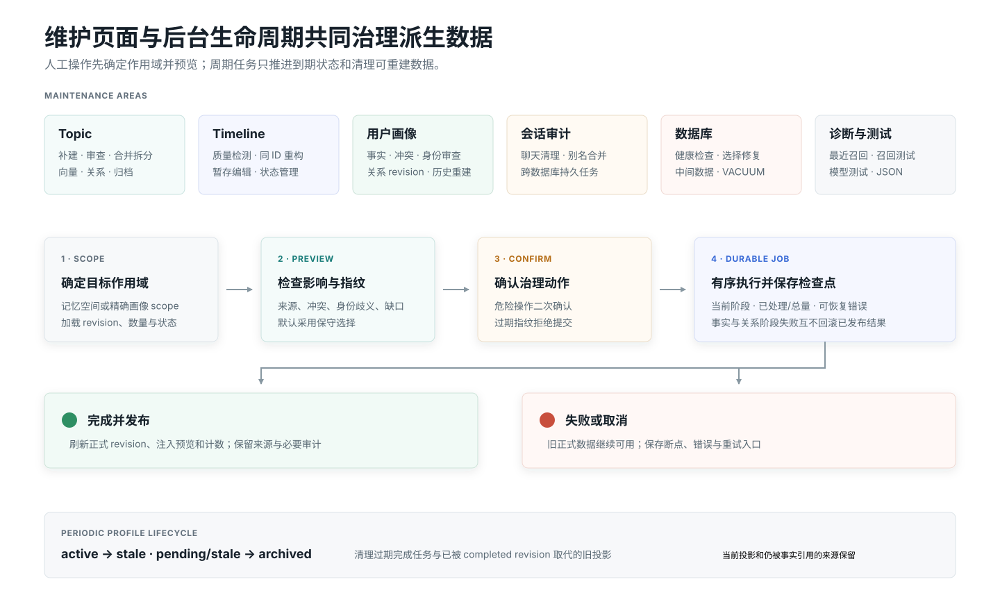

# 维护中心

维护中心将检查、预览、确认、执行和进度做成一致流程。高风险操作不会隐藏在列表详情里，也不会在没有选择记忆空间时误触发。

{.diagram}

## Topic 记忆维护

| 操作 | 是否调用 LLM | 说明 |
| --- | --- | --- |
| 重新向量化并重算关系 | 否 | Embedding 签名变化后更新正式片段和 Topic 向量 |
| 重新计算相关话题 | 否 | 使用现有向量替换无方向关系图 |
| 增量补建 | 是 | 检测未被活跃 Topic 索引的 Timeline，确认后补建 |
| Topic 待审查 | 视选择而定 | 对真正歧义的片段选择合并、新建、暂缓或忽略 |
| Topic 拆分 / 合并 | 是 | 以正式片段分组预览后原子发布；预览重绘会保留当前选择 |
| 已归档 Topic | 否 | 核对并永久清理；自动派生数据不直接恢复 |
| 清空 Topic | 否 | 删除当前空间全部 Topic 派生数据，不影响 Timeline |

## Timeline 记忆维护

- 检测有完整证据、可同 ID 重构的 Timeline；默认不勾选。
- 批量应用暂存编辑后，再统一同步受影响 Topic。
- 管理不活跃 Timeline，按需恢复或永久删除。
- 重构失败保留旧 Timeline；成功后至少修复关联 Topic，也可选择完整 Topic 重建。

## 用户画像维护

用户画像栏目按稳定私聊账号、Bot 账号和 persona 展示画像作用域。详情顶部用四块紧凑状态摘要分别显示：作用域与 Bot/persona、客观画像 revision 与各状态计数、人格关系 revision 与执行时 persona 依据，以及进行中任务和未投影断层。详情中的“实际注入预览”使用与私聊热路径相同的筛选、时效和字符预算，并显示实际字符数、事实数和关系是否纳入，便于核对 Bot 当前真正能看到的内容。

| 区域 | 可执行操作 |
| --- | --- |
| 客观事实 | 查看原始 Timeline 事实和来源 revision；确认 pending、暂停/恢复注入、固定或排除；只有 active 可注入 |
| 冲突 | 选择胜出事实、保持暂停或全部排除；后续新证据仍可触发自动复核 |
| 人格关系 | 调整六维数值、标签、主观叙述、变化敏感度和行为模式；冻结、重置、历史重建或回滚 revision |
| 账号 | 预览后人工绑定多个平台账号；解绑时按原始账号来源重新投影 |
| 客观共享 | 为同一逻辑用户显式选择 Bot/persona 作用域；人格关系不参与共享 |
| 恢复 | 查看维护任务、重试失败任务、处理断层或从历史重建 |

事实正文不能在画像页直接改写；需要纠正时应编辑权威 Timeline，或使用确认、暂停、排除和冲突裁决等独立覆盖。`pending`、`conflict` 和 `stale` 会明确归入不注入区域。关系主观叙述和维度允许直接编辑，历史值保留在 revision 中；模型维护产生的 revision 会标明使用了执行时当前 persona，但不保存人格正文或快照。

“重置画像”清除当前派生结果但保持启用，之后只处理新变化；“删除并停用”同时删除画像与关系状态并阻止自动重新建档。两者都不同于历史重建。历史重建会先显示精确可归属 Timeline、身份歧义、缺失记录、当前事实和人工覆盖数量，并同时使用画像与历史指纹拒绝过期提交。身份不明确的旧 Timeline 不会被猜测归属；历史关系使用当前同 ID persona，revision 诊断会标记该来源。

周期性画像生命周期任务与人工维护并行运行。它按配置将到期 `active` 转为 `stale`，将到期 `pending` 和长期 `stale` 归档，并清理超过保留期的已完成任务和可由 completed revision 确定重建的旧投影；当前投影与仍被事实引用的来源始终保留。页面中的进行中任务和断层计数用于区分“正在处理”与“尚未投影”，不会把未完成状态误当成已发布画像。

## 会话审计

会话审计区分平台、Bot 账号、私聊或群聊、对象、最后活动时间、消息数量、未总结数量和记忆引用。可执行：

1. 清理已总结的聊天记录；
2. 删除全部聊天记录并保留 Timeline / Topic；
3. 合并会话别名；
4. 完整删除会话记忆链。

后两类删除会明确标注风险。涉及 `conversations.db` 和主记忆库的操作使用持久化维护任务保证可恢复，而不是假设跨库事务。

## 数据库维护

健康检查只读执行 SQLite 完整性、外键和记忆来源检查；修复只处理用户勾选项目。空间维护可预览和清理已完成构建的中间数据，压缩数据库使用独立连接短暂锁库，因此不自动在每次构建后运行。

## 最近召回与测试

生产召回记录默认关闭。临时开启后可以查看原始触发、入选记忆、真实注入和完整诊断，也可以逐条导出、删除或全部清空。

召回测试保存独立历史，支持 Timeline、Topic 和当前插件行为三种模式，并可复制 JSON；模型测试分别验证实际运行时采用的 LLM、Embedding 和 Rerank。

## 原子发布与回滚

长任务先生成中间态，只有全部校验通过才在一个发布阶段替换正式 Topic。构建期间继续召回旧版本；失败、取消或进程中断不会暴露半套 Topic、原子或人物关系。

所有确认型异步操作在提交后立即进入忙碌状态并禁用重复确认。页面重绘不会清除尚未提交的拆分/合并选择，持久化任务在刷新页面后继续显示进度。
