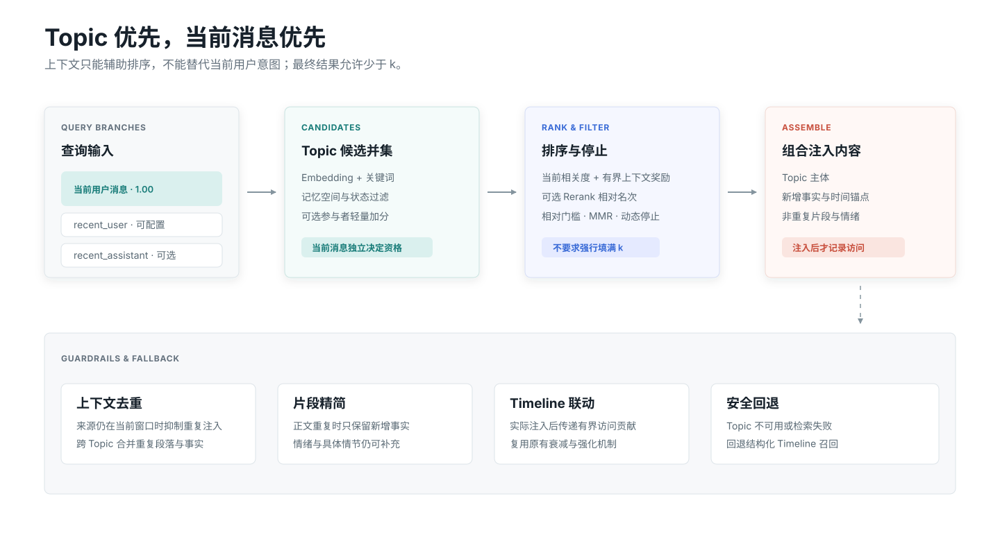

# 召回与注入

正式召回以 Topic 为主体，用事实和正式片段补充具体细节、时间与情绪。Topic 不可用或检索失败时自动回退 Timeline。

{.diagram}

## 查询分支

当前用户消息权重固定为 `1.0`，始终决定候选资格。启用跨轮扩展后，最近用户消息与可选 Bot 回复形成低权重辅助分支，但不能单独把 Topic 推进入选集合。

| 分支 | 默认行为 |
| --- | --- |
| 当前用户消息 | 主查询，必须达到独立最低门槛 |
| recent_user | 可配置，默认权重低于当前消息 |
| recent_assistant | 可选择不查询、低权重或正常查询 |

## Topic 候选与 Rerank

Embedding 与关键词负责候选资格和基础相关度。Rerank 只对合格候选重排，其相对名次奖励会根据本轮区分度调整；低区分度 Rerank 不应压掉明确的语义命中。

结果还会经过相对门槛、人物轻量奖励、上下文覆盖抑制、MMR 多样性和动态停止。模糊查询允许少于 `k` 条结果，不会为了填满数量注入明显无关的记忆。

## Topic、事实与片段如何组合

1. 注入 Topic 主体，建立主题和长期结论。
2. 选择确实增加新信息的正式片段。
3. 若片段正文与 Topic 高度重复，只保留该片段的新增事实。
4. 合并重复事实和跨 Topic 重复段落。
5. 带入必要的时间锚点、人物与情绪信息。

## Timeline 动态联动

Topic 被实际注入后，会把有界的访问贡献传递给相关来源 Timeline。这会参与原有访问强化与清理判断，避免长期使用 Topic 后 Timeline 因“从未召回”而被错误衰减。

## 主动工具与时间约束

`recall_long_term_memory` 复用同一召回管线，但允许 Agent 提供可选时间约束。时间检索不在被动注入中自动启用，也不依赖 `conversations.db`；没有更精确来源时，以 Timeline 保存的时间范围为基准。

`memorize_long_term_memory` 用于 Agent 主动写入明确需要长期保留的信息，默认关闭。

## 诊断

召回测试会显示当前相关度、上下文奖励、Embedding、关键词、Rerank 原始值与名次、人物奖励、过滤原因、正式片段选择和真实注入内容。生产召回记录默认关闭，可在维护中心临时启用。
