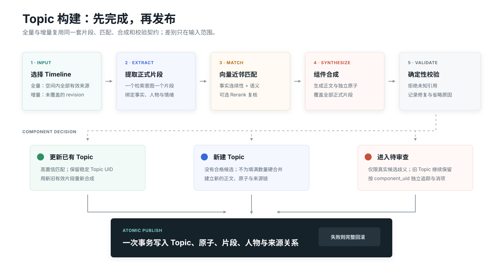

# Topic 记忆

Topic 将多个时间点的相关 Timeline 片段整理为一个适合召回的主题。它是自动维护的派生数据，因此只读；需要修正内容时，应修改或重构来源 Timeline。

{.diagram}

## 全量构建

全量构建扫描一个记忆空间中的 Timeline，提取单一检索意图的正式片段，再执行向量匹配、可选 Rerank、组件复核和 Topic 合成。所有结果先写入中间态，准备完成后一次性原子发布。

构建失败、取消或插件重启时，旧 Topic 继续可用。断点继续只复用输入、配置、Prompt 与模型签名仍一致的阶段。

## 增量构建

增量采用 delta-first 管线：只处理当前 revision 尚未进入活跃 Topic 的 Timeline。新正式片段通过向量近邻找到有限数量的既有 Topic，再根据事实连续性、语义、关键词、人物和时间决定：

1. 高置信匹配：合并到已有 Topic 并重新合成。
2. 没有合格候选：新建 Topic。
3. 多个候选非常接近且确有语义风险：进入待审查。

同一 Timeline 只提供弱连续性信号，不能因为共享来源就把其中不同话题强行合并。

## 正式片段

正式片段不是临时 Prompt 文本，而是带版本和来源的派生对象。它保存：

- 单一检索意图的正文；
- 事实、时间范围与来源事实键；
- 参与者、被提及人物和语义角色；
- 情绪事件与证据；
- Timeline UID、revision 与来源范围；
- Embedding 签名和向量。

## Topic 内容

Topic 拥有自己的摘要、原子、人物索引、情绪画像和相关话题。详情页将常用信息直接展示，标识符、情绪与完整溯源收纳在“更多信息”中；人物按稳定身份合并为胶囊，展开后再查看角色和具体事实。

## 相关话题

相关话题是无方向、无父子层级的稀疏连接。调整阈值后可仅使用已有向量重新计算，不调用 LLM，也不重建 Topic 正文。
